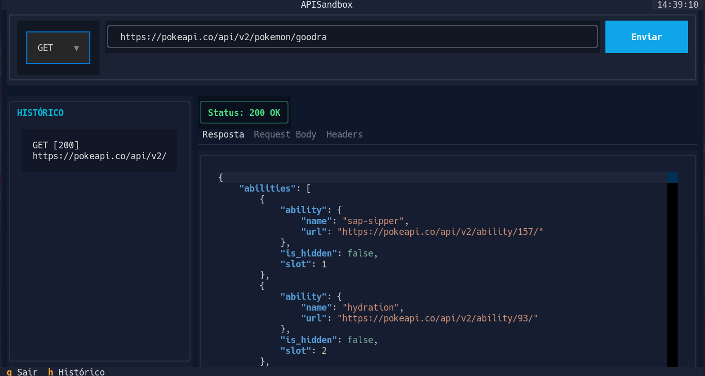
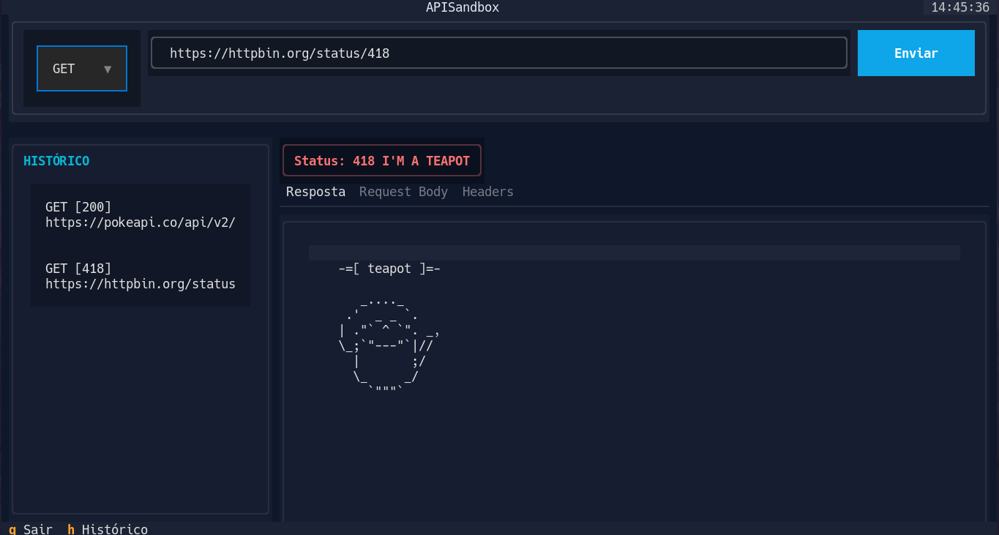

# APISandbox

APISandbox é uma ferramenta de teste de API via linha de comando (TUI) desenvolvida em Python utilizando a biblioteca [Textual](https://textual.textualize.io/). Esta aplicação permite realizar requisições HTTP (GET, POST, PUT, DELETE, PATCH) de forma rápida e eficiente diretamente no terminal, servindo como uma alternativa leve a ferramentas como Postman ou Insomnia.

## Funcionalidades

- Suporte completo aos métodos HTTP: GET, POST, PUT, DELETE e PATCH.
- Editor de corpo de requisição com suporte a JSON.
- Exibição de resposta formatada com destaque de sintaxe.
- Visualização detalhada dos cabeçalhos da resposta.
- Painel lateral para histórico de requisições (acesso rápido a requisições anteriores).
- Feedback visual claro para códigos de status (sucesso/erro).
- Interface responsiva e navegável via teclado.

## Atalhos de Teclado

- q: Sair da aplicação.
- h: Alternar (exibir/ocultar) o painel de histórico.
- Tab: Navegar entre os elementos da interface.
- Enter: Enviar a requisição.

## Imagens:





## Como Executar

### 1. Pré-requisitos
* **Python 3.10** ou superior.

### 2. Instalação
1. Clone o repositório para sua máquina:
```bash
git clone https://github.com/FilipyTav/PyLibPresentation.git
cd PyLibPresentation
```

2. Crie um ambiente virtual:
```bash
python -m venv venv
```

3. Ative o ambiente:

- Windows:
```bash
venv\Scripts\activate
```

- Linux:
```bash
source venv/bin/activate
```

4. Instale as dependências necessárias:
```bash
pip install -r requirements.txt
```

### 3. Execução
Execute o arquivo principal:
```bash
python src/main.py
```
